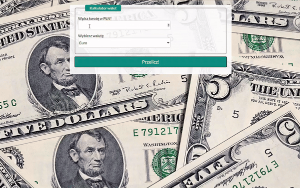

# Simply currency converter

## Demo 
(https://mariuszkalinowski.github.io/currency-react/)

## Discription 

It is simply and easy to use a currency converter. All you need to do is write an amount in input and choose a one of three available currencies. 
You have a choice:
- **USD** 
- **EUR**
- **GBP**

Have fun! 

## About

It is my next project in JavaScript and second with react. I am really proud of myself, maybe not about time which I need to end this, but everything else. I really really like it. I know that calculator is very simple and right now ChatGPT make it 10x faster and better, but hell yea, one year ago I didnt expect that I could write this. 
I hope that maybe next 2-3 years I will be read this one more time while sitting in my office and working for IT
